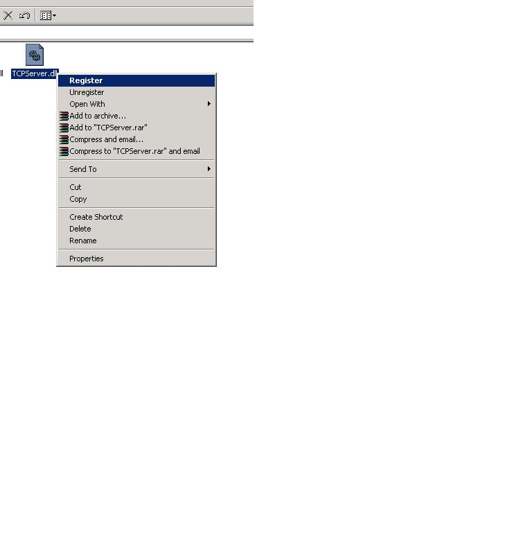

## Integrate Regsvr32 with Shell \(Click to register/unregister \.dll or \.ocx or \.tlb

### Description

Now updated with the possiblity to register/unregister typelibs (*.tlb) it can now

also handle long filenames, thanks Vlad :-)

I got tired of using regsvr32 the old way, so I integrated it to the shell.

Makes life easier to register/unregister an .dll or .ocx file with just an click.

I can´t figure out why I have not thought about it before :-)))

What you need to do is to create your own .reg file putting in below info using notepad and naming the file to regsvr32.reg

Or you can download my already made .reg file
 
### More Info
 

             |
---                |---
**Submitted On**   |2003-11-22 01:59:02
**By**             |[Knoton](https://github.com/Planet-Source-Code/PSCIndex/blob/master/ByAuthor/knoton.md)
**Level**          |Beginner
**User Rating**    |5.0 (30 globes from 6 users)
**Compatibility**  |VB 6\.0
**Category**       |[Registry](https://github.com/Planet-Source-Code/PSCIndex/blob/master/ByCategory/registry__1-36.md)
**World**          |[Visual Basic](https://github.com/Planet-Source-Code/PSCIndex/blob/master/ByWorld/visual-basic.md)
**Archive File**   |[Integrate\_16747011222003\.zip](https://github.com/Planet-Source-Code/knoton-integrate-regsvr32-with-shell-click-to-register-unregister-dll-or-ocx-or-tlb__1-49897/archive/master.zip)

### Source Code

Windows Registry Editor Version 5.00 
[HKEY_CLASSES_ROOT\dllfile\Shell] 
[HKEY_CLASSES_ROOT\dllfile\Shell\Register] 
[HKEY_CLASSES_ROOT\dllfile\Shell\Register\Command] 
@="Regsvr32 \"%L\"" 
[HKEY_CLASSES_ROOT\dllfile\Shell\Unregister] 
[HKEY_CLASSES_ROOT\dllfile\Shell\Unregister\Command] 
@="Regsvr32 /u \"%L\"" 
[HKEY_CLASSES_ROOT\ocxfile\Shell] 
[HKEY_CLASSES_ROOT\ocxfile\Shell\Register] 
[HKEY_CLASSES_ROOT\ocxfile\Shell\Register\Command] 
@="Regsvr32 \"%L\"" 
[HKEY_CLASSES_ROOT\ocxfile\Shell\Unregister] 
[HKEY_CLASSES_ROOT\ocxfile\Shell\Unregister\Command] 
@="Regsvr32 /u \"%L\"" 
[HKEY_CLASSES_ROOT\.tlb] 
@="typelib" 
[HKEY_CLASSES_ROOT\typelib\shell\Register\command] 
@="regtlib \"%L\"" 
[HKEY_CLASSES_ROOT\typelib\shell\Unregister\command] 
@="regtlib -u \"%L\"" 

